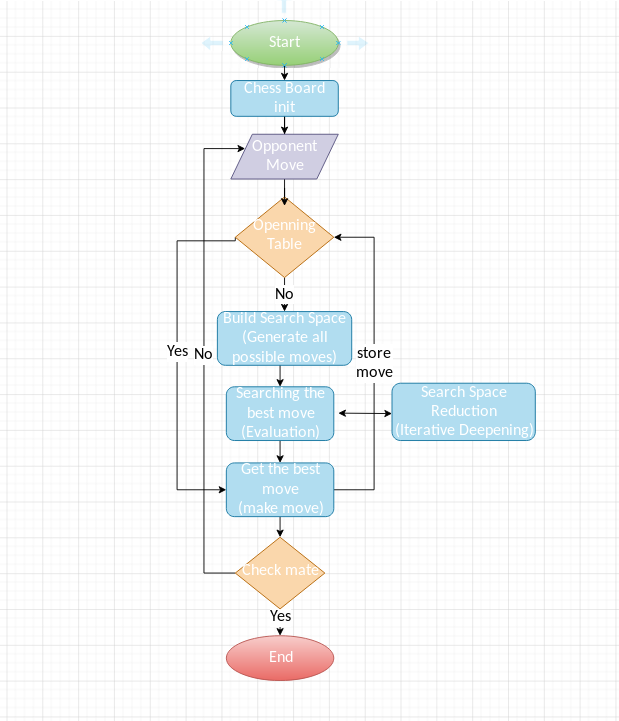
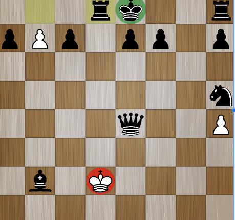

# Chess AI
The aim from this project is to use advanced algorithms for enhancing the run time/ improve and AI performance in the  chess game. Using AI to generate all possible moves (Search Space) from any chess board state, then looking for the best move within a reasonable time-limit.

# Project satges:
Chess AI flow chart can be shown in below image. 
                                  

# Run This Project:
To run this project you have to install [pygame](https://www.pygame.org/news).
             
                  pip install pygame
                  python Main.py 
              
              
# Sample of the output:

# Methods:
* **NegaMax:** a tree searching algorithm derived
from minimax, which looks to the future to
minimizes the maximum value that your opponent
can take from you and decide how best to make
your next move.
* **Alpha-beta** pruning: used to decrease the
number of nodes that are evaluated by the
negamax algorithm.

# Contribution:
* **Evaluation function** that uses the following
heuristics (defined by chess players):
  * Further developed pieces are better.
  * Doubled Pawns are not good
  * Isolated Pawns are not good
* **Iterative Deepening:** It is the improvement for
depth-limited search, Instead of specifying a fixed
search depth, It starts working with depth 1, then
depth 2, and continue incrementing the depth until
the time allocated for the search is exhausted
* **Multi-Threading:** We implement the search in the
search tree to execute in parallel to reduce the total
execution time.
* We cache the evaluated steps, so we can make
use of them in case of repetition to reduce the
execution time.
* We handle the end phase of the game in a
special way and we use previously evaluated
positions from online chess databases that contain
the games of master players.

# Future work:
* Applying further enhancement would make the
engine better. We think that applying methods like
Neural Network, Genetic Algorithms, and random
selection in the evaluation function would have
interesting results.

# AlgorithmicsProject
* This project has been done for [Algorithmics (MTAT.03.238)](https://courses.cs.ut.ee/2019/algorithmics/fall) course at the University of Tartu under the supervision of Jaak Vilo, Dmytro Fishman, and Joonas Puura.

# Refrences
[1] https://www.freecodecamp.org/news/simple-chess-ai-step-by-step-1d55a9266977/  
[2] https://www.chessprogramming.org/Main_Page  
[3] Campbell, Murray, A. Joseph Hoane Jr, and Feng-hsiung Hsu. "Deep blue." Artificial intelligence 134.1-2 (2002): 57-83.  
[4] https://www.youtube.com/watch?v=STjW3eH0Cik

